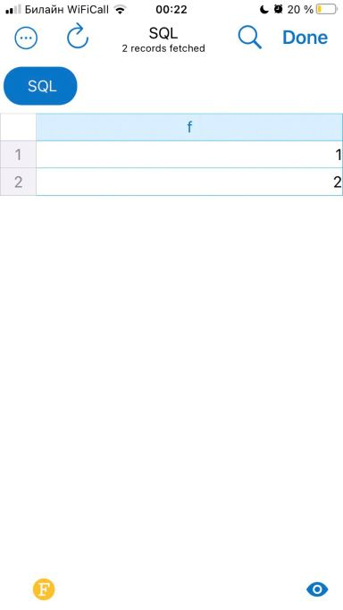

>создать ВМ с Ubuntu 20.04/22.04 или **развернуть докер любым удобным способом**

Докер на домашнем ноуте, Windows 10, IP-адрес 192.168.77.100

>поставить на нем Docker Engine

Docker Engine  
v20.10.22

>сделать каталог /var/lib/postgres

для разнообразия сделаю друой 

docker volume create --name n0dar  

>развернуть контейнер с PostgreSQL 14 смонтировав в него /var/lib/postgres

docker pull postgres:14  

docker run --name pgServer -e POSTGRES_PASSWORD=postgres -d -p 5432:5432 -v n0dar:/var/lib/postgresql/data postgres:14  

>развернуть контейнер с клиентом postgres
>подключится из контейнера с клиентом к контейнеру с сервером

docker run -it  --rm --name pgClient postgres:14 psql -h 192.168.77.100 -p 5432 -U postgres  
Password for user postgres:  
psql (14.7 (Debian 14.7-1.pgdg110+1))  
Type "help" for help.  
  
postgres=#   

>и сделать таблицу с парой строк

postgres=# CREATE DATABASE testdb;  
CREATE DATABASE  
postgres=# \c testdb;  
You are now connected to database "testdb" as user "postgres".  
testdb=# CREATE TABLE t(f INT);   
CREATE TABLE  
testdb=# INSERT INTO t SELECT 1 UNION SELECT 2;  
INSERT 0 2  
testdb=#  

>подключится к контейнеру с сервером с ноутбука/компьютера извне инстансов GCP/ЯО/места установки докера

не совем понял, зачем конкретно здесь нужно было подключаться, но пусть будет так  

>удалить контейнер с сервером

docker stop pgServer  
docker rm  pgServer  

docker ps  
CONTAINER ID   IMAGE     COMMAND   CREATED   STATUS    PORTS     NAMES  

docker volume ls  
DRIVER    VOLUME NAME  
local     n0dar  

том жив =) 

>создать его заново

docker run --name pgServer -e POSTGRES_PASSWORD=postgres -d -p 5432:5432 -v n0dar:/var/lib/postgresql/data postgres:14  

>подключится снова из контейнера с клиентом к контейнеру с сервером  

контейнер с клиентом самоубился (так как создавался с параметром --rm), поэтому создаем/запускаем его заново и подключаемся к серваеру в контейнере pgServer  

docker run -it  --rm --name pgClient postgres:14 psql -h 192.168.77.100 -p 5432 -U postgres  
Password for user postgres:   
psql (14.7 (Debian 14.7-1.pgdg110+1))  
Type "help" for help.  

postgres=#

>проверить, что данные остались на месте

postgres=# \c testdb  
You are now connected to database "testdb" as user "postgres".  
testdb=# SELECT * FROM t;  
 f  
\---  
 1  
 2  
(2 rows)  

testdb=#
